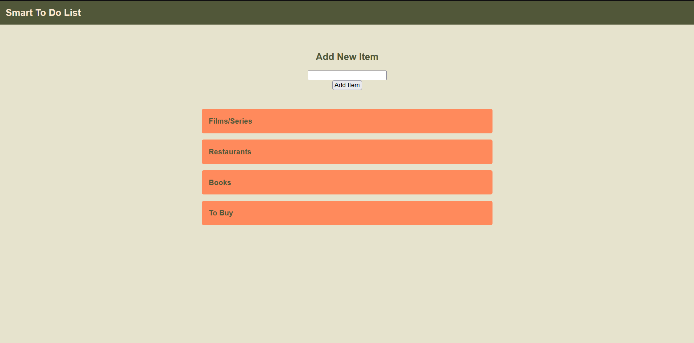

Smart To Do List
=========

## Objective

Using Openai to create a Smart To Do List. Submitting an item will be categorized into one of four categories: Movies/Series, Books, Restaurants and To Buy. Each item can be ```completed``` (by pressing the checkbox icon), ```deleted``` (by pressing the trash can icon), and `updated` (by pressing the update button.). If an item cannot be automatically sorted, the app will prompt the user if they still wish to add the item.

## Getting Started

1. Fork the [repository](https://github.com/makenziewakefield/smart_todo_list)
2. Git clone your new repository
3. Install dependencies: `npm i`
4. Run PSQL and create a `Database` using the schema and seeds
5. Place your [OpenAi](https://openai.com/) Key in a dotenv file using `OPENAI_API_KEY=(your openai key)`
6. Run `npm run local`
7. Visit `http://localhost:8080/`

## Images

An empty To Do List with the four categories

## Dependencies
- chalk 
- cookie-parser 
- dotenv 
- ejs 
- express 
- morgan 
- openai 
- pg
- sass 
- Nodemon

## Contributors
- [makenziewakefield](https://github.com/makenziewakefield)
- [Fakeha-38](https://github.com/Fakeha-38)
- [Krisan10](https://github.com/Krisan10) 